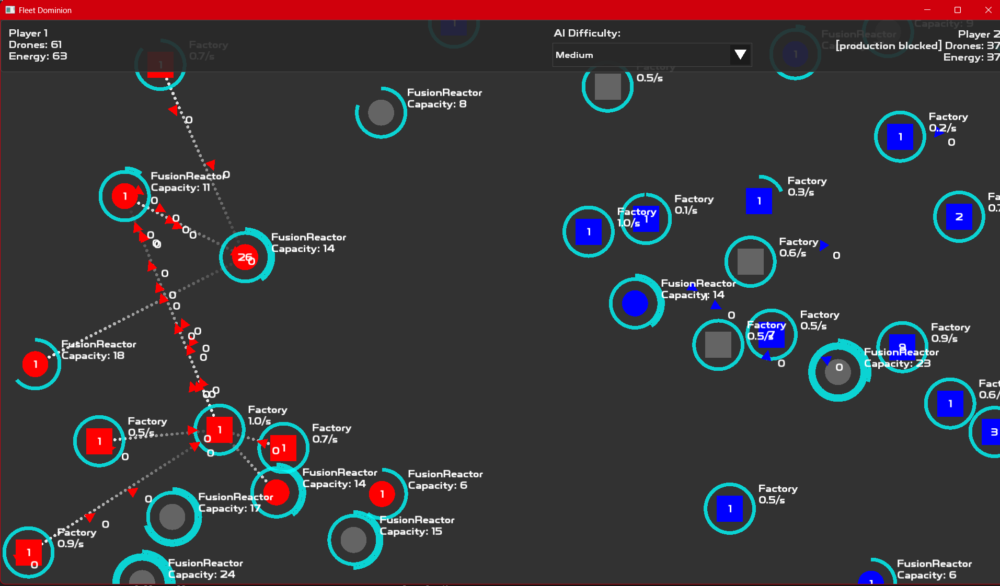
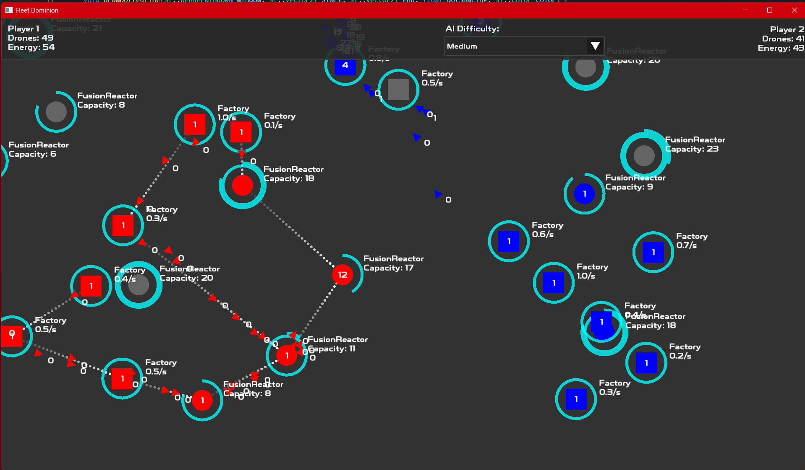

# Fleet Commander

### Space strategy game

### How to play

- Factories produce drones up to the maximum enery capacity
- Power plants increase the maximum capacity
- Use drones to conquer other structures
- Select structure and:
    - left click to attack another target
    - right click to create drone transfer route
    - right click anywhere (not on target) to cancel existing route
- W A S D to move around the world

### Screenshots




### Build from source


#### Dependencies

```
# get the package manager
cd /opt
git clone git@github.com/microsoft/vcpkg.git
cd vcpkg
./bootstrap-vcpkg.sh # linux, macos
bootstrap.bat  # windows

# install dependencies

./vcpkg install sfml
./vcpkg install tgui
./vcpkg install entt

```

#### Build

Go to the root folder where the repository was cloned

```
mkdir build
cd build

cmake .. "-DCMAKE_BUILD_TYPE=Release" "-DCMAKE_TOOLCHAIN_FILE=/opt/vcpkg/scripts/buildsystems/vcpkg.cmake"
cmake --build . --parallel 4
```

### TODO

- Skin the game (sprites+animations)
- Improve map generation
- Increase map size
- Allow routing even if unit is not owned by player (eg. potential routing between structures if they become conquered)
